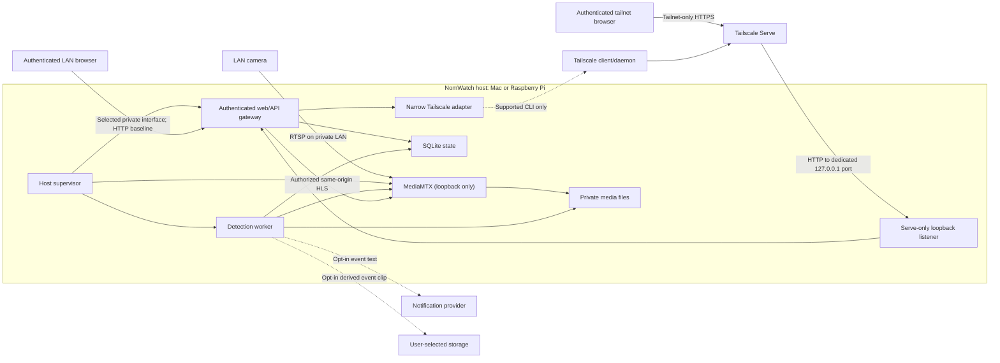

# ADR 0001: Local-first host with authenticated LAN access and private Tailscale Serve

- **Status:** Proposed for acceptance; product constraints are fixed, implementation is pending
- **Date:** 2026-07-14
- **Owners:** NomWatch architecture
- **Scope:** The current Python/Flask web-only codebase on macOS and Raspberry Pi OS
- **Supersedes:** The remote-access and process-lifecycle portions of `docs/ARCHITECTURE.md`; the existing detection decisions remain in force

## Decision summary

NomWatch will become a single local appliance hosted by a laptop or Raspberry Pi. One OS-supervised `nomwatch host` process will own the authenticated web gateway, worker supervision, local persistence, MediaMTX lifecycle, LAN discovery, and the narrow Tailscale integration. Tailscale itself remains an independently installed and managed system service.

The baseline is authenticated access on an explicitly selected private LAN interface. The preferred remote-access path is Tailscale Serve over tailnet-only HTTPS. NomWatch will never configure, recommend, or depend on public exposure, router port forwarding, UPnP, DDNS, or Tailscale Funnel.

The principal decisions are:

1. Local NomWatch accounts are required on both LAN and Tailscale paths. Tailscale authorization adds a network boundary; it does not replace application authentication.
2. MediaMTX, camera RTSP, model inference, rolling recordings, and raw diagnostic frames remain local. MediaMTX listens on authenticated loopback endpoints only. The authenticated web gateway proxies live HLS on the same origin as the UI.
3. SQLite becomes the transactional source of truth for accounts, sessions, settings metadata, events, media records, jobs, audit records, and migrations. Media bytes remain private files referenced by opaque IDs.
4. LAN discovery uses a stable per-installation mDNS name plus displayed IP fallbacks. Discovery is convenience, never identity or authorization.
5. A Tailscale adapter uses only supported CLI commands. It uses a dedicated loopback backend, requires exclusive ownership of the node hostname's web-serving namespace, and records one exact private Serve listener. It attempts path-scoped removal only while live state still exactly matches that ownership record; otherwise it fails closed. It does not manage tailnet policy, auth keys, routes, the Tailscale daemon, or unrelated Serve entries.
6. macOS uses a per-user LaunchAgent for the whole host runtime. Raspberry Pi OS uses a system-level systemd unit under a dedicated unprivileged user. Tailscale is optional for service startup, so LAN operation survives Tailscale outages or logout.
7. Existing installations remain loopback-only after upgrade until an owner account is created and LAN access is explicitly enabled. Migration is additive and backed up; it never silently adopts an existing Tailscale mapping.

## Context from the current repository

The current code is a useful single-user proof of concept, but its loopback bind is its effective authorization boundary. Widening that bind today would expose privileged operations and private media.

| Current behavior | Repository evidence | Architectural implication |
| --- | --- | --- |
| Flask's development server binds only to `127.0.0.1`; there is no production HTTP service. | [`nomwatch/webui.py`](../../nomwatch/webui.py#L2440-L2442), [`nomwatch/cli.py`](../../nomwatch/cli.py#L688-L699) | Authentication and a production gateway must land before LAN or Tailscale exposure. |
| There is no account, session, CSRF, role, or trusted-host middleware. Mutating routes can start processes, install services, change settings, import config, and delete data. | [`nomwatch/webui.py`](../../nomwatch/webui.py#L1804-L1842), [`nomwatch/webui.py`](../../nomwatch/webui.py#L1911-L2076) | Treat the present UI as a trusted loopback admin console only. |
| The setup page renders the saved camera password, and config export includes it. | [`nomwatch/webui.py`](../../nomwatch/webui.py#L2042-L2053), [`nomwatch/webui.py`](../../nomwatch/webui.py#L2080-L2113) | Secrets must use replace-only fields and be excluded from ordinary API responses and web exports. |
| The browser is given a `127.0.0.1` MediaMTX URL. A remote phone would connect to itself, and HTTPS would encounter mixed-content/origin problems. | [`nomwatch/webui.py`](../../nomwatch/webui.py#L1864-L1894), [`nomwatch/webui.py`](../../nomwatch/webui.py#L2171-L2186) | Proxy playlists and segments through authenticated same-origin routes. |
| MediaMTX is correctly loopback-only, but detection still opens the credential-bearing camera RTSP URL directly. | [`nomwatch/bridge.py`](../../nomwatch/bridge.py#L39-L53), [`nomwatch/cli.py`](../../nomwatch/cli.py#L434-L450) | Make MediaMTX the sole camera client and let all local consumers use its loopback streams/recordings. |
| UI, monitoring, and MediaMTX are detached or independently managed and tracked by PID files. launchd starts only `nomwatch run`. | [`nomwatch/webui.py`](../../nomwatch/webui.py#L172-L220), [`nomwatch/bridge.py`](../../nomwatch/bridge.py#L200-L262), [`nomwatch/service.py`](../../nomwatch/service.py#L53-L100) | Replace sibling process control with one foreground supervisor owned by the OS service manager. |
| Linux service management is not implemented. The current macOS service is a user LaunchAgent despite documentation saying it survives logout. | [`nomwatch/service.py`](../../nomwatch/service.py#L1-L8), [`nomwatch/service.py`](../../nomwatch/service.py#L49-L50) | State platform guarantees precisely and add a real Raspberry Pi system service. |
| Config is a single owner-only YAML file; events are JSONL; media, logs, and diagnostics share `~/.config/nomwatch`. | [`nomwatch/config.py`](../../nomwatch/config.py#L17-L18), [`nomwatch/config.py`](../../nomwatch/config.py#L156-L192), [`nomwatch/cli.py`](../../nomwatch/cli.py#L466-L527) | Add schema versions, transactions, permissions, retention, migrations, and stable IDs. |
| The only Tailscale mutator publishes HLS directly and has no caller, status model, teardown, ownership, conflict handling, or UI. | [`nomwatch/bridge.py`](../../nomwatch/bridge.py#L274-L291) | Replace it with a tested adapter that publishes the authenticated gateway only. |
| Browser HLS code is loaded from jsDelivr and notification QR images use a public QR service. | [`nomwatch/webui.py`](../../nomwatch/webui.py#L365), [`nomwatch/webui.py`](../../nomwatch/webui.py#L1135-L1138) | Vendor browser assets and generate all access QR codes locally. |

## Fixed constraints and non-goals

- The host is the authority for accounts, settings, events, clips, and detection. There is no NomWatch cloud account, relay, or control plane.
- “Raw video stays local” means the camera RTSP endpoint, rolling pre-roll/source segments, inference frames, and continuous recordings do not leave the host/LAN or enter third-party storage. Authenticated live viewing deliberately sends an on-demand HLS remux—which can contain the camera's original encoded video bitstream—to the chosen client; Tailscale carries it end-to-end encrypted when remote. Camera-to-host RTSP may itself be plaintext on the trusted LAN unless the camera supports a secure transport.
- Optional outbound notifications may contain event text. Optional storage backends may export a derived event clip only after explicit owner configuration. Neither changes the default local-only storage posture.
- No public listener, public reverse proxy, router change, UPnP, port forwarding, DDNS, or public link is part of NomWatch.
- Tailscale Funnel is prohibited. The only allowed inspection of Funnel state is a read-only safety check that prevents enablement whenever the node hostname already has a public mapping.
- The initial database still represents one shared appliance and one configured camera. Multi-camera support and per-user ownership of cameras/events are separate product decisions.
- Tailscale identity headers are not an authentication bypass. They may be evaluated later for audit enrichment only after a dedicated trusted-proxy boundary exists.
- Native mobile apps, arbitrary event types, remote inference, and a NomWatch-operated PKI are out of scope.

## Target architecture



### Runtime and process ownership

`nomwatch host` is one foreground parent process. The OS service manager owns only this process. The parent owns real child handles rather than discovering siblings with PID files or `pgrep`.

The host contains these logical components behind interfaces that can be replaced with fakes in tests:

- **Gateway:** Waitress-hosted WSGI application, HTML/static files, `/api/v1`, auth middleware, and HLS gateway. It uses separate local/LAN and Serve-only listener configurations.
- **Supervisor:** starts, health-checks, backs off, and cleanly stops MediaMTX and the monitor worker. A child crash does not kill the UI; repeated failure becomes a visible degraded state rather than an infinite tight restart loop.
- **Monitor worker:** consumes MediaMTX's loopback RTSP endpoint, persists an event before starting downstream work, and writes clip/notification/storage work to a durable job/outbox table. Clip waits and upload retries no longer block future detection polls.
- **MediaMTX:** the sole steady-state camera network client. Its RTSP and HLS listeners remain loopback-only and require per-install random read credentials; its API, metrics, playback, and unused protocols remain disabled. The host necessarily handles the camera secret when it renders the private MediaMTX config.
- **Tailscale adapter:** observes and reconciles one NomWatch-owned Serve mapping. Tailscale is never a child of NomWatch.
- **mDNS advertiser:** publishes only non-secret discovery metadata after LAN access is enabled.

The existing `fcntl` monitor lock remains temporarily as defense in depth during migration. PID files become observational compatibility artifacts and are removed after old launch paths are retired.

### Media and privacy boundary

The gateway, not MediaMTX, is the only HTTP service exposed to users.

1. Camera credentials are consumed only by the host when it renders a private MediaMTX configuration.
2. MediaMTX pulls one camera stream and exposes credential-protected RTSP/HLS on loopback. Gateway/detector credentials must not appear in logs, diagnostics, API output, or process listings.
3. Detection reads the loopback MediaMTX stream. `ollama_host` is restricted to loopback in the supported local-first mode; Raspberry Pi defaults to the motion engine unless local hardware can support more.
4. `/api/v1/live/<camera_id>/...` authenticates every manifest and segment request, checks the `viewer` permission, and proxies from MediaMTX. Playlists are rewritten to same-origin relative URLs.
5. Live/clip responses use `Cache-Control: no-store`, a strict referrer policy, and no service-worker persistence. Concurrency and bandwidth limits protect a small Pi from accidental denial of service.
6. Raw rolling segments and flagged inference frames stay in private host directories with explicit retention. They are never notification attachments and never included in ordinary backup/export.
7. Optional cloud storage is labeled **Export event clips** and remains off unless the owner selects it. Continuous video and pre-roll source segments are never exported.

This replaces the current direct-HLS Serve concept. Any Tailscale-authorized peer who can reach the host—including a member, an external user with an accepted device share, or a tagged device allowed by policy—must still pass NomWatch authorization before receiving video.

## Threat model

### Assets

- Camera username/password and the ability to connect to the camera.
- Live video, rolling segments, diagnostic frames, thumbnails, and event clips.
- Local password hashes, session tokens, bootstrap/invitation tokens, and role assignments.
- Notification/storage credentials and exported event links.
- Settings and process-control capabilities.
- Tailscale node/Serve state and the private access URL.
- Availability and SD-card/disk endurance on small hosts.

### Trust boundaries and controls

| Threat actor or failure | In scope? | Primary controls | Residual risk |
| --- | --- | --- | --- |
| Unauthenticated device on the home LAN | Yes | Required login, roles, rate limits, selected-interface bind, trusted Host/Origin checks, no open registration | LAN HTTP metadata and traffic remain visible to an on-path observer. |
| Passive or active observer on the LAN | Partially | Explicit trusted-LAN warning; no public interfaces; Tailscale HTTPS is the recommended secure transport even at home | Seamless browser-trusted LAN TLS is not possible without external/local PKI. LAN HTTP does not provide confidentiality or MITM protection. |
| Tailscale-authorized peer who is not a NomWatch user | Yes | Tailnet policy plus independent NomWatch login/RBAC | A member, externally shared user, or policy-authorized tagged device can reach the login surface and attempt rate-limited guesses. |
| Compromised browser or stolen session | Yes | Opaque revocable sessions, idle/absolute expiry, session list/revoke, reauthentication for security-sensitive actions | A live session retains its assigned role until revoked/expired. |
| Malicious website targeting a logged-in browser | Yes | Synchronizer CSRF token, SameSite cookies, Origin checks, no state-changing GET, CSP and frame denial | Browser/plugin compromise is outside the web control boundary. |
| DNS rebinding or spoofed mDNS | Yes | Host allowlist, selected bind addresses, auth; mDNS is never trusted as identity | A spoof alone does not bypass auth, but LAN HTTP still permits an active look-alike/MITM to steal credentials or a session. |
| SSRF through camera test/config | Yes | Owner-only route; fixed RTSP scheme; resolve-and-pin; allow only selected private-LAN ranges; block loopback, link-local metadata, service ports, and redirects | A malicious owner can intentionally target other private services; owner is already trusted with host configuration. |
| Compromised low-privilege NomWatch web account | Yes | `viewer`/`operator`/`owner` authorization and step-up auth | A viewer can see intentionally shared household video. |
| Different unprivileged OS user/process on the host | Yes | `0700`/`0600` data, authenticated MediaMTX reads, no secrets in argv/logs, local IPC peer authorization | Loopback is machine-wide; implementation tests must prove another UID cannot retrieve media or invoke control operations. |
| Compromised `nomwatch` OS service account | Partially | Private files, no root service, hardened systemd unit, narrow root helper, fixed command grammar | It can read local media and app secrets because the service must use them. |
| Root/admin or same-user malware on the host | No | OS updates, disk encryption, screen lock, backups | Such an actor can read process memory/files and control the camera connection. Filesystem encryption with a co-located unattended key would not solve this. |
| Tailscale identity/control-plane compromise | Partially | NomWatch account remains a second application boundary | Network reachability could expand; local credentials are still required. |
| Tailscale certificate metadata disclosure | Yes | Pre-enable disclosure and non-sensitive machine-name guidance | Enabling Tailscale HTTPS publishes the node's full `.ts.net` name in public Certificate Transparency logs even though service access remains private. |
| Public exposure caused by configuration drift | Yes | No public-listener features, exact Serve ownership, read-only public-port guard, post-change verification, fail closed | A user can independently configure unrelated public services outside NomWatch. Manual same-hostname remapping also creates a bounded interval before NomWatch detects drift and revokes its cookies. |
| Disk exhaustion, process crash, or power loss | Yes | SQLite transactions/WAL, durable outbox, atomic files, retention, bounded restarts, service manager | Sudden power loss can still lose the currently open media segment. |
| Third-party UI/QR supply chain | Yes | Bundle HLS/QR assets locally; restrictive CSP; no access URL sent to QR services | Packaged dependency compromise remains a release-engineering concern. |

### Explicit security posture for LAN HTTP

The LAN baseline is useful when Tailscale is absent, but it is a **trusted-home-network mode**, not a claim of encrypted transport. Passwords, session cookies, and video can be observed or modified by an active LAN adversary. The UI must state this plainly and recommend the Tailscale HTTPS URL for sensitive use, including while at home.

Self-signed certificates are not the default: without a trusted local CA they create browser warnings and do not give ordinary users a reliable way to distinguish the real host from a MITM. Bootstrap and activation codes stop off-path first-visitor claims, but they do not stop an on-path attacker from stealing the code, password, or resulting session. Owner bootstrap therefore stays on loopback (directly or through SSH). An optional local-PKI mode would require a separate ADR and client onboarding design.

## Local accounts, authorization, and sessions

Accounts belong to the shared NomWatch appliance. Events and cameras are not partitioned per user.

### Roles

| Capability | Viewer | Operator | Owner |
| --- | :---: | :---: | :---: |
| View health, live stream, events, thumbnails, and clips | Yes | Yes | Yes |
| Download a clip | Yes | Yes | Yes |
| Start, stop, or restart monitoring; test a notification | No | Yes | Yes |
| Change camera/detection/storage/notification settings | No | No | Yes |
| Add/disable users and revoke sessions | No | No | Yes |
| Enable/disable or change LAN interfaces | No | No | Yes, with recent password reauthentication and staged rollback |
| Enable/disable Tailscale access | No | No | Yes, with recent password reauthentication |
| Import/export redacted settings, delete clips, prune history | No | No | Yes, with confirmation; no secret-bearing web export |
| Install OS services/packages | No | No | No web role; local installer/CLI only |

The first account is the owner. The last enabled owner cannot be disabled or demoted.

### Bootstrap and recovery

- A new host generates a single-use bootstrap code with at least 128 bits of entropy, displays it in the local installer/terminal, stores only its hash, and expires it after 15 minutes.
- A desktop install opens the loopback claim page. A headless Pi uses an SSH local-port forward to the loopback claim page; bootstrap is not accepted over the unauthenticated LAN listener.
- The first visitor can never claim the appliance without that code.
- Owners create later users by generating a single-use invitation/activation code that expires after 30 minutes and assigning a role. The recipient sets their own password. There is no email dependency or open registration.
- Password recovery is a local OS command such as `nomwatch admin reset-password <user>`. It invalidates every session for that user. There is no cloud recovery channel.

### Passwords and sessions

- Passwords use a maintained Argon2id implementation with versioned parameters and automatic rehash on login. Parameters are chosen with a Raspberry Pi memory/latency budget and tested on supported hardware.
- A session cookie contains a random 256-bit opaque token. SQLite stores only a keyed hash/digest, never the bearer token.
- Sessions default to a 12-hour idle expiry and a 7-day absolute expiry, with no “remember me” in the first release. Cookies are `HttpOnly`, `SameSite=Lax`, and host-only. The HTTPS/Tailscale cookie is `Secure`; the LAN HTTP origin necessarily uses a separate non-Secure cookie. Sessions are not shared between `.local`, IP, and `.ts.net` origins.
- Claim/login use a short-lived anonymous pre-auth session plus strict `Origin` and Fetch Metadata validation; successful login replaces it rather than upgrading the same identifier. Every authenticated state-changing request requires a per-session synchronizer CSRF token and an allowed `Origin`. Login attempts are rate-limited by account and source, with bounded audit events.
- Password, role, or disabled-state changes increment the user's session version and revoke every prior session transactionally; a replacement is issued only to the current authorized actor when appropriate. Owners can list and revoke their own or another user's sessions.
- Session `last_seen` writes are coalesced to at most once per five minutes per active session and never occur per HLS segment, limiting SQLite/WAL and Raspberry Pi SD-card write amplification.
- Security-sensitive owner actions require password reauthentication within the previous 10 minutes. Tailscale identity headers do not satisfy this step-up.

### Secret handling in the UI

- Settings responses expose `camera_password_set: true`, not the password. Blank means “keep existing”; replacement is a dedicated owner action.
- Notification/storage tokens follow the same replace-only pattern.
- Ordinary settings backup is redacted. A full secret-bearing backup, if implemented, is an explicitly named, password-encrypted export after owner reauthentication; it never contains password hashes, sessions, or bootstrap tokens.
- API responses expose opaque media/event IDs, never absolute host filesystem paths.

## Local data model

SQLite runs with foreign keys, WAL, a busy timeout, explicit transactions, and ordered schema migrations. The daemon uses an umask of `0077`; the data root is `0700` and private files are `0600`.

| Table/logical store | Key fields and purpose |
| --- | --- |
| `schema_migrations` | Ordered migration ID, application version, applied timestamp, checksum. |
| `installation` | Stable random installation ID, display name, mDNS slug, created time. One row. |
| `users` | ID, normalized unique username, display name, Argon2id hash, role, disabled time, password/session version, timestamps. |
| `sessions` | Token digest, user ID, CSRF secret digest, issued/last-seen/idle/absolute expiry, origin class, revoked time, coarse client metadata. |
| `activation_tokens` | Hashed bootstrap/invitation token, purpose, role/user target, expiry, consumed time. |
| `cameras` | Stable ID, display name, private host/port, stream path, username, password secret reference, enabled state, optimistic revision. One row in the initial product. |
| `settings` | Namespaced validated JSON (`bridge`, `detection`, `notification`, `storage`, `network`) with schema version and optimistic revision. |
| `secret_refs` | Opaque references to a private platform secret store; no plaintext secret is returned through settings APIs. |
| `events` | Stable ID, camera ID, timestamps, confidence/reason, status, error summary, created/updated times. |
| `media_files` | Stable ID, event ID, kind, relative private path, MIME type, size, checksum, retention state. No blob video in SQLite. |
| `jobs` | Durable outbox for clip finalization, notification, thumbnailing, export, cleanup; attempt count, next run, idempotency key, terminal error. |
| `remote_access` | Desired enabled state, owned HTTPS port/target, Tailscale node identity at creation, status fingerprint, observed URL/error, timestamps. |
| `audit_log` | Actor, action, object ID, result, time, source class. No passwords, tokens, raw bodies, or camera frames. |

`events.camera_id` is a foreign key to the initial single row in `cameras`. Its stable generated ID fixes event identity without committing the product to multi-camera UI.

Secrets require unattended use, so NomWatch will not claim that encrypting them with a key stored beside the daemon defeats host compromise. The portable baseline is a separate owner-only secret file/store referenced by ID; macOS Keychain can be an adapter where unattended LaunchAgent access is reliable. Raspberry Pi uses a service-owned `0600` store under `/var/lib/nomwatch`. Full-disk encryption and OS account security remain the controls for a stolen host.

### Retention

- Rolling MediaMTX segments: time-bounded and local, as today.
- Flagged inference frames: count/time-bounded, owner-configurable, off by default after calibration.
- Final clips/events: owner-configurable retention with disk-space floor and dry-run preview.
- Thumbnails: derived cache, regenerable, deleted with or before their source.
- Audit/application logs: size/time rotation; Raspberry Pi defaults are conservative for SD-card endurance.
- Jobs: completed rows compacted after an audit window; failed jobs retained long enough to diagnose.

## LAN discovery and addressing

### Listener policy

The host always owns a local-administration loopback listener. When remote access is enabled, Tailscale Serve targets a second loopback-only backend port with a fixed expected external `.ts.net` authority. LAN access is a separate desired state.

The Serve-only listener derives external scheme/authority from its verified listener configuration, not from `Host`, `Forwarded`, or `X-Forwarded-*`. It accepts only the currently observed `.ts.net` authority, rejects LAN Hosts, and may consume Tailscale identity headers only if a later ADR enables that use. Local/LAN listeners reject `.ts.net` Hosts and strip/ignore all proxy and Tailscale identity headers. This separation governs Secure cookies, redirects, Origin validation, audit source, and rate limits.

- `loopback`: `127.0.0.1`/`::1` only. This remains the upgrade default until an owner exists.
- `lan`: bind to addresses on one or more owner-selected private interfaces. Do not use an unconditional `0.0.0.0`/`::` listener, which can accidentally include public IPv6, VPN, container, or future interfaces. Address binding is not by itself an ingress-interface firewall on weak-host platforms. The platform adapter must enforce ingress-interface isolation with an OS interface-bound socket or an installer-owned narrow firewall rule and then probe cross-interface reachability. If that primitive or verification is unavailable, the staged LAN enable fails and rolls back; NomWatch never silently falls back to address-only isolation.
- `custom`: advanced explicit addresses, still subject to public-address rejection unless a future ADR changes the product boundary.

On DHCP, sleep/wake, or link changes, the host re-resolves the selected interface, safely rebinds, updates allowed Hosts, and republishes discovery. Loopback remains available throughout.

LAN changes use staged apply: bind and self-test the candidate address first, then require owner confirmation from the new URL or another still-active trusted path within 60 seconds. Failure or timeout rolls back. Disabling the listener currently carrying the admin session requires loopback/Tailscale access or the local control CLI, preventing an accidental remote lockout.

NomWatch never changes the router or enables port forwarding. An OS firewall prompt must say “private/home networks only.”

### Names and discovery

- NomWatch explicitly probes and publishes its own mDNS A/AAAA hostname such as `nomwatch-a1b2.local`, derived from a random installation suffix rather than a pet/user name; DNS-SD registration alone would not create that hostname.
- Advertise `NomWatch A1B2._nomwatch._tcp.local.` only on selected LAN interface indexes. Its SRV record targets the actual collision-resolved hostname/port; TXT contains only small versioned fields such as `txtvers=1` and `protovers=1`. Do not advertise usernames, camera names, tailnet names, or access tokens.
- Persist the collision-resolved name, which is stable only while conflict-free. On a later conflict, choose a deterministic suffix, update allowed Hosts, and surface the new URL. mDNS is best effort and works only within the local broadcast domain.
- The Access screen always shows a locally generated QR/copy link for the mDNS URL and current selected-interface IP URLs. A QR contains a URL only, never a login or invitation token unless the user is explicitly in the short-lived user-invitation flow.
- Host header validation accepts only loopback names, the current mDNS name, selected current IP literals, and the currently observed Tailscale DNS name/port.

Camera addressing remains separate. Setup selects the home camera-facing interface before testing a camera, then permits only addresses on directly connected private subnets for that interface. Steady-state detection and viewing use MediaMTX as the sole camera network client. The owner-initiated pre-commit camera test is the one bounded exception: a short-lived, rate-limited ffmpeg RTSP probe may connect directly after resolve-and-pin SSRF validation, never persists credentials, and cannot run concurrently with the configured stream. The first phase accepts a private IP or local hostname and recommends a DHCP reservation. ONVIF/WS-Discovery auto-discovery is useful but deferred; it must not delay secure host discovery or be treated as camera identity.

## Tailscale integration

### Product behavior

Remote Access is one stateful card in owner settings, not a collection of shell instructions. It presents these states:

| State | Detection | UX/action |
| --- | --- | --- |
| `not_installed` | No supported CLI/app found | Platform-specific official install guidance and one-click open of the official installer/download page; poll after the user completes OS approval. |
| `daemon_unavailable` | CLI exists; structured status fails | macOS: open/start the Tailscale app. Pi: show `tailscaled` service diagnostics and a copyable local repair command. LAN remains healthy. |
| `needs_login` | `BackendState` is not running and indicates authentication is needed | Owner clicks **Sign in to Tailscale**. Prefer the official app on macOS or run one bounded allowlisted login job on Pi; validate the returned action URL, open it without logging/persisting it, and poll. Never ask for or store an auth key. |
| `connected` | Running with a Tailscale DNS name and completely enumerable node Serve state | Explain tailnet-only access, the exclusive-hostname requirement, and offer **Enable private access**. |
| `needs_serve_consent` | A Serve attempt reports that MagicDNS, tailnet HTTPS, role approval, or consent is missing | Explain that access remains tailnet-private but the full machine/tailnet DNS name will appear in public Certificate Transparency logs; recommend changing a sensitive machine name in Tailscale first, then show only a validated official consent URL and recheck. Do not substitute an HTTP remote endpoint. |
| `conflict` | Any other node-level Serve/Funnel configuration exists, the hostname is not exclusive, a mutation raced, or state cannot be enumerated safely | Preserve user configuration and explain that cookie sessions require a dedicated hostname. Do not overwrite, reset, or fall back to another port on the same hostname. |
| `enabled` | The exact private root Serve mapping is the sole node-level web mapping, and observed Funnel state confirms that it is not public | Show private badge, copy/open buttons, local QR, DNS URL, and last verification time. |
| `degraded` | Desired mapping disappeared, Tailscale logged out, hostname/tailnet changed, another mapping appeared, or verification failed | Keep LAN working. Close the Serve-only backend and revoke Tailscale-origin NomWatch sessions on hostname/config drift; reconcile only when exclusivity can again be proved. |

The QR is generated on the NomWatch host. The URL is not sent to a third-party QR service and does not contain a NomWatch session or Tailscale credential.

NomWatch issues `.ts.net` cookie sessions only through the Serve-only listener and marks them with the observed Tailscale node/tailnet context. Because browser cookies have no port isolation, the first release requires NomWatch to be the sole node-hostname Serve/Funnel web application; a later concurrent mapping triggers remote-session revocation when drift is detected.

While private access is enabled, reconciliation runs at host start, after every adapter operation or Tailscale/network state change, and at least every 30 seconds. A fresh status check is mandatory before issuing a new `.ts.net` session or accepting a security-sensitive owner mutation on that origin. Existing low-risk requests may use the last verified state until the next poll. A manual hostname remap can therefore expose host-scoped NomWatch cookies to the replacement application for at most the detection interval; closing the backend and revoking every Tailscale-origin session on detection limits but cannot eliminate that browser-cookie risk. The UI documents this residual and recommends not manually editing the node's Serve/Funnel state while NomWatch private access is enabled.

### Supported CLI boundary

The adapter uses the Tailscale CLI rather than internal state files, undocumented LocalAPI calls, or the Tailscale management API. Version 1.52 is only the historical Serve-v2 syntax boundary, not a sufficient support guarantee. Each NomWatch release declares and tests a concrete Tailscale version/variant range; unknown older/newer structured output disables mutation and leaves LAN operation intact.

Read-only observations are limited to version/state commands equivalent to:

```text
tailscale version --json
tailscale status --json
tailscale serve status --json
tailscale funnel status --json   # read-only guard only; never presented as a feature
tailscale serve get-config --all # inventory of distinct Tailscale Services only
```

The only user-triggered mutations are equivalent to:

```text
tailscale login --timeout=<bounded-duration>
tailscale serve --bg --yes --https=443 --set-path=/ http://127.0.0.1:<serve-ingress-port>
tailscale serve --yes --https=443 --set-path=/ off
```

The versioned inverse is path-scoped and tested against supported clients. The helper accepts fixed typed operations and an installer-owned ingress-port tuple, never arbitrary argv, targets, URLs, shell text, caller-selected ports, flags, auth keys, tags, routes, hostnames, exit-node settings, or daemon actions. Login/consent URLs are accepted only when they are HTTPS URLs matching documented Tailscale origins/patterns; they are treated as bearer-like, redacted from logs, and discarded when the bounded job is reaped.

NomWatch never invokes `serve reset`; it would erase unrelated user configuration. It never invokes a Funnel mutation. The read-only Funnel status check inventories the node's public mappings. A macOS variant capability matrix distinguishes “Funnel unsupported” from command/daemon failure; any unrecognized result fails closed.

### Mapping choice and ownership

1. Read version/variant, connection, complete node-level Serve status, public Funnel status, and the separate Tailscale Services inventory. `serve status --json` remains the node configuration source; `get-config --all` describes distinct Services and does not replace it. If the adapter cannot prove it understands the complete node web-serving state, mutation is unavailable.
2. Require no pre-existing node-level Serve or Funnel mapping on any port/path/protocol. Browser cookies are scoped to a hostname, not a port, so `:8443` cannot safely isolate NomWatch from an unrelated `:443` service.
3. Record the node identity/tailnet context, fixed port 443/root path, fixed Serve-only loopback target, pre-change status, and time.
4. Apply the path-scoped persistent background Serve proxy to the authenticated Serve-only gateway listener, not MediaMTX. Tailscale owns `--bg` persistence across reboot and `tailscale down`/`up`; NomWatch verifies state on host start rather than launching a proxy sidecar.
5. Re-read all state. Success requires the exact root Serve target to be the sole node-level web mapping and observed Funnel state to confirm that it is not public. Derive the displayed URL from current structured node DNS state, trimming the terminal dot; never scrape friendly prose or trust the stale `tailscale_hostname` field.
6. If the post-check shows only the just-created exact mapping and otherwise matches the precondition, a failed enable may use the path-scoped inverse. If any unexpected concurrent state appeared, do not issue a blind rollback: close the Serve backend, revoke remote sessions, report conflict, and preserve the live configuration for manual resolution.

Serve CLI updates have their own internal optimistic concurrency behavior, but NomWatch's earlier inspection and later CLI call cannot be one atomic transaction. Ownership is therefore a conservative best-effort guarantee, not a race-free promise. On disable, NomWatch runs the path-scoped inverse only if live state still exactly matches the sole owned mapping. Otherwise it closes its backend, revokes Tailscale-origin sessions, marks a conflict, and asks the owner to resolve it.

Supported uninstall closes the Serve backend first, attempts the same conservative cleanup, and re-reads state. It removes the host runtime, fixed ingress-port reservation, and ownership record only after proving the owned target is absent. If Tailscale is unavailable or live state conflicts, uninstall stops in a prominent `cleanup_required` state with the runtime disabled but its package, inert port guard, and durable ownership record intact; it supplies local recovery instructions and retries when Tailscale returns. This prevents a persistent `--bg` proxy from later forwarding to an unrelated process that reuses the port. The user must resolve/remove the mapping and rerun uninstall; there is no web or unattended force-delete path.

An existing manual Serve entry is always user-owned, including a legacy mapping to port 8888. NomWatch may warn that a direct HLS mapping bypasses application auth and offer instructions, but it never silently adopts or removes it.

### What NomWatch does not own

- Tailscale installation/update policy or package repositories.
- The `tailscaled` daemon/app lifecycle, except launching the installed macOS app for user interaction.
- Tailnet membership, device approval, expiry, MagicDNS, HTTPS enablement, account switching, ACLs/grants, device sharing, or admin-console policy.
- Auth keys, OAuth clients, API tokens, tags, subnet routes, exit nodes, Tailscale SSH, or other local Serve mappings.
- Whether another tailnet device is allowed by policy. The UI links to Tailscale's policy guidance but does not edit policy.

### Platform execution boundary

- **macOS:** search the installed CLI integration and the bundled app CLI path, setting `TAILSCALE_BE_CLI=1` for scripted app-binary calls. Prefer the official Standalone app and user-facing sign-in. Do not install a second variant. Capability detection accounts for Standalone, App Store, and open-source variants rather than assuming identical command support.
- **Raspberry Pi OS:** read-only status normally uses `/usr/bin/tailscale`. Mutations go through a root-owned, fixed-protocol helper installed with the system package. Do not make the web daemon root and do not grant the `nomwatch` account general Tailscale operator rights. The helper authenticates Unix-socket peers, invokes an absolute binary with a minimal environment and no shell, independently rechecks complete state, accepts only its fixed operation/port tuple, bounds output/time, serializes jobs, and permits login only when it independently observes a logged-out state.
- Package installation remains an explicit local installer/terminal step. The web UI detects and guides; it does not execute remote install scripts or a general package manager as root.

## Service management

### Packaging and executable layout

The web host is the product, not an optional extra. `pip install nomwatch` includes Flask, Waitress, Argon2, mDNS/DNS-SD, and local QR-generation dependencies; Drive and heavyweight model runtimes remain optional extras. Release installers create a managed, root/user-owned virtual environment at a stable path (`~/.local/share/nomwatch/runtime` on macOS and `/opt/nomwatch` on Pi) and point service manifests at that exact console script. They do not capture an arbitrary development virtualenv that may move later.

Waitress is the initial production WSGI implementation because it preserves the Flask application seam and runs on both target platforms. The host configures distinct local/LAN and Serve-only loopback listeners; long jobs and media work stay outside request threads.

### Common service contract

- One foreground command: `nomwatch host`.
- Readiness means database migrated, gateway listening on loopback, and supervisor running. Camera, MediaMTX, model, LAN, storage export, notifications, and Tailscale are independent capability states and may be degraded without taking down the UI.
- SIGTERM causes the gateway to stop accepting work, workers to drain/cancel safely, MediaMTX to stop, SQLite to checkpoint, mDNS to withdraw, and the parent to exit within a bounded timeout.
- Restart uses exponential backoff with a stable-run reset and visible last-error/attempt counters.
- Structured logs redact URLs containing credentials and rotate locally. Pi uses journald as the primary sink.
- No web endpoint installs/uninstalls the OS service or packages. Those remain local privileged installer/CLI actions.

### Local control IPC

CLI compatibility and recovery use a versioned local Unix-domain control protocol, not an unauthenticated TCP/loopback HTTP bypass.

- macOS socket: under the private `NOMWATCH_HOME` runtime directory, mode `0600`, same LaunchAgent user only.
- Pi socket: `/run/nomwatch/control.sock`, owned by `nomwatch:nomwatch-admin`, mode `0660`; only explicitly enrolled local administrators join that group.
- The daemon verifies peer credentials (`getpeereid` on macOS, `SO_PEERCRED` on Linux), then accepts length-bounded, versioned JSON messages from a fixed operation enum. It never accepts shell commands, raw URLs, SQL, file paths, or role claims from the caller.
- If the daemon is absent, normal commands report that state. Offline password/database recovery requires the OS service to be stopped, local root/owner authority, and an exclusive database/migration lock; it cannot race the live daemon.
- The separate root Tailscale helper has its own smaller socket/protocol and does not trust NomWatch's database ownership record without independently checking live Tailscale state.

### macOS

Use a per-user LaunchAgent for the complete host runtime, preserving the current low-friction install model.

- Modern `launchctl bootstrap gui/<uid>` and `bootout`, not legacy `load/unload`.
- `RunAtLoad`, restart on abnormal failure rather than unconditional crash-looping, a throttle interval, explicit working/data directories, stable executable path, and the required Homebrew/system paths.
- Local rotating logs with an owner-visible diagnostics page.
- Reconcile network addresses, mDNS, camera, MediaMTX, and Tailscale state after wake/network change.
- State the limitation precisely: it starts after that user logs in, stops when the login session ends, and cannot monitor while a sleeping laptop is asleep. “Start at boot before login” requires a signed/admin-installed LaunchDaemon and is deferred.

### Raspberry Pi OS

Use a system-level systemd service so a headless appliance works before any interactive login.

- Dedicated `nomwatch` user/group; `StateDirectory=nomwatch`, `RuntimeDirectory=nomwatch`, `UMask=0077`.
- `Wants=network-online.target` and `After=network-online.target`; ordering after `tailscaled.service` may be present, but Tailscale is never `Required`.
- `Restart=on-failure`, bounded delay/start limits, `KillMode=control-group`, and watchdog/readiness integration.
- Hardening such as `NoNewPrivileges`, private temp, restricted system paths, and only the required writable state/media paths. External clip destinations require an explicit allowlisted path override.
- journald limits plus application media/log retention suitable for SD cards.
- The Tailscale helper, if installed, is a separate root-owned unit/socket with a tiny typed protocol; it is not part of the main service's privilege set.

## API and UI changes

### API shape

Introduce `/api/v1` and a single frontend `apiFetch` wrapper. HTML requests may redirect to login; API requests always return structured JSON with proper `401`, `403`, `409`, `422`, and `5xx` status codes.

| Area | Representative endpoints | Authorization/behavior |
| --- | --- | --- |
| Bootstrap/auth | `GET /api/v1/bootstrap`, `POST /claim`, `/login`, `/logout`, `GET /me` | Claim requires local code. Login is rate-limited. |
| Users/sessions | `/api/v1/users`, `/invitations`, `/sessions`, `/sessions/<id>/revoke` | Owner except self-session operations. |
| Capabilities/health | `/api/v1/status`, `/capabilities` | Viewer; stable state enums, no raw command output or secrets. |
| Settings | `/api/v1/settings/<namespace>` | Owner; ETag/revision and `If-Match` prevent lost concurrent edits. Secret replacement is separate. |
| Camera test | `/api/v1/cameras/<id>/test` | Owner; SSRF restrictions and async job. |
| Monitoring | `/api/v1/monitoring`, `/start`, `/stop`, `/restart` | Operator; changes desired worker state, not OS service state. |
| Events/media | `/api/v1/events`, `/events/<id>`, `/media/<id>` | Viewer; opaque IDs, Range support, no local paths. Delete requires owner. |
| Live stream | `/api/v1/live/<camera_id>/<path>` | Viewer on every playlist/segment request; same origin and no-store. |
| LAN access | `/api/v1/access/lan`, `/interfaces`, `/stage`, `/confirm`, `/disable` | Owner plus recent reauth for mutations; candidate listener self-tests, requires confirmation through a surviving/new path, and rolls back on timeout. |
| Remote access | `/api/v1/remote-access/tailscale`, `/enable`, `/disable`, `/login` | Owner plus recent password reauth for mutations; long actions return `202` and a job ID. |
| Jobs | `/api/v1/jobs/<id>` | Role must match the initiating operation; safe progress/error only. |
| Export/migration | `/api/v1/settings-export`, `/migration-status` | Owner; settings export is always redacted. Secret-bearing migration snapshots are local-only and never returned by this API. |

Keep authenticated legacy `/api/...` aliases for one compatibility release where the semantics remain safe. The current inline UI switches to `/api/v1`; aliases emit deprecation headers. Dangerous behavior such as plaintext secret export is not preserved merely for compatibility.

### Browser/UI work

- Login, bootstrap claim, user/session management, and role-aware navigation.
- A shared Access page with LAN and Tailscale cards, plain-language trust labels, URLs, locally rendered QR, copy/open buttons, last verification, and troubleshooting.
- Saved secret fields never prefill. The UI says “saved” and offers replacement.
- Centralized handling for unauthenticated/forbidden/conflict/job responses.
- Bundle HLS and QR libraries locally and apply a restrictive CSP, `frame-ancestors 'none'`, `X-Content-Type-Options: nosniff`, `Referrer-Policy: no-referrer`, and appropriate cache controls.
- Break the current single large HTML/Python module into auth, API, gateway, services, templates, and static assets incrementally; preserve `create_app()` as the dependency-injection seam.
- Remove web package/service installation controls. Replace them with capability diagnostics and local installer instructions.

## UX flows

### Fresh desktop host

1. Installer creates the private data root and starts `nomwatch host` on loopback.
2. It opens the local claim page and displays a one-time code.
3. User creates the owner account, selects the camera-facing home interface while the UI remains loopback-only, configures camera/detection, and verifies a frame locally.
4. Access setup lets the owner enable LAN mode on that interface. It stages/self-tests the listener and shows the `.local` and IP URLs plus the trusted-LAN warning.
5. Optional Remote Access detects Tailscale. Missing prerequisites open official install/sign-in guidance; once connected, the UI discloses Certificate Transparency hostname metadata and verifies exclusive web use of the node hostname before one click creates the private Serve mapping.
6. UI shows the private HTTPS URL and a locally generated QR. Scanning opens the login page; it does not log the phone in automatically.

### Fresh headless Raspberry Pi

1. Local package install creates the system user, data directory, systemd unit, and optional narrow helper.
2. Terminal/SSH output prints the one-time owner code and an SSH local-port-forward command. The claim code expires if unused.
3. Owner claims the appliance through the loopback URL carried by that tunnel, then explicitly enables the selected LAN interface and completes the same web wizard.
4. The Tailscale card detects `/usr/bin/tailscale` and `tailscaled`. If sign-in is needed, an explicit owner action starts the allowlisted login flow and presents the official auth URL.
5. Reboot acceptance requires the UI, MediaMTX, monitoring, mDNS, and the owned Serve mapping to recover without an interactive login. LAN remains available if Tailscale is down.

### Add a household user

1. Owner selects role and creates an activation code/link with a short expiry.
2. Recipient opens the local or private URL, enters the code, chooses a username/password, and receives a new session on that origin.
3. Owner can later disable the user or revoke individual/all sessions. Existing video/events remain shared appliance data.

### Returning local/remote user

1. The same relative UI/API/media URLs work on LAN and Tailscale.
2. User authenticates separately per origin.
3. Viewer sees live/events; operator sees monitor controls; owner sees settings/users/access. Unauthorized controls are absent in the UI and rejected by the API.

### Disable or repair remote access

1. Owner reauthenticates and clicks disable.
2. Adapter verifies exact sole ownership and applies the path-scoped disable. It closes the Serve-only backend and revokes Tailscale-origin sessions; LAN accounts/data are unchanged.
3. If Tailscale is logged out, renamed, switched to another tailnet, or manually reconfigured, UI closes its backend, revokes remote sessions, enters degraded/conflict state, and does not run a global reset or blind rollback.
4. NomWatch never logs the user out of Tailscale or uninstalls it.

### Account recovery

1. User obtains local OS/SSH access to the host.
2. Local admin command resets the selected password or creates a time-limited recovery claim.
3. All affected sessions are revoked and the action is audited. There is no remote backdoor or vendor recovery service.

## Migration and backwards compatibility

### Safety rules

- Upgrading never changes a loopback listener to LAN and never enables Tailscale automatically.
- Before migration, stop legacy writers and create a named **migration snapshot** under `NOMWATCH_HOME/migration-backups/<timestamp>`. Its directory is `0700`, files are `0600`, and it contains a checksummed secret-bearing copy of `config.yml`, `events.jsonl`, owned service manifests, and metadata about media paths; rolling video is not copied unnecessarily. It is excluded from diagnostics and every web export, retained for 30 days after verified cutover by default, and may be deleted earlier by the owner.
- Migrations are ordered, idempotent, transactional, and recorded. Unknown/newer schema versions cause a clear refusal rather than a destructive downgrade.
- Existing YAML/JSONL/media remain untouched until verification. The database records a deterministic legacy source ID/hash so re-running import does not duplicate events.
- There is no ongoing dual-write of settings; it would create split-brain truth. Downgrade requires restoring the pre-migration backup and does not include data created afterward. Provide explicit JSON/CSV event export instead.

The first database/runtime migration is an atomic cutover: quiesce and lock the legacy monitor/config writers; snapshot; import; start `nomwatch host`; verify database/control socket, MediaMTX config/health, monitor-lock ownership, and camera behavior at least as healthy as before; then boot out only the exact old service. Any failure stops the new host and restores the old service/snapshot. Phases 0–2 below are implementation milestones, not independently releasable upgrade states; Phase 1 exercises shadow copies until Phase 2 can perform this cutover.

### Data paths

- Introduce a single `NOMWATCH_HOME` abstraction.
- For the first compatible macOS release, preserve `~/.config/nomwatch` as the default and harden it to `0700`; moving to `~/Library/Application Support/NomWatch` is not required for this architecture change.
- Fresh Pi system installs use `/var/lib/nomwatch` for mutable state/media and `/run/nomwatch` for runtime IPC. Root-owned package/service configuration lives under `/etc` or `/usr/lib` as appropriate.
- An existing manual Pi/Linux install under a user's `~/.config/nomwatch` is detected by the privileged installer. After quiescing that user's processes/services, it checksums and copies state into `/var/lib/nomwatch`, assigns the dedicated service ownership, rewrites the migration map, and leaves the source as the secret-bearing rollback snapshot. External media paths are copied or explicitly allowlisted/chowned; an inaccessible path blocks cutover rather than being silently dropped.
- Relative media references in SQLite are rooted at `NOMWATCH_HOME`; imported absolute legacy paths are normalized into a migration map and never returned to browsers.

### Import mapping

- `config.yml` sections map into namespaced, versioned settings. Camera/provider secrets move to the private secret store.
- `events.jsonl` rows receive deterministic event IDs; existing clips are linked by checksum/path after validation. Missing clips remain valid historical events.
- Heartbeat/PID files are not durable data and are not imported.
- Existing classifications/flagged frames may be retained as legacy diagnostics with a retention prompt, not promoted into event history automatically.
- The legacy config import becomes a settings migration path. A **redacted settings export** contains no secrets, accounts, sessions, media, or ownership. A **local operational database backup** used for same-host disaster recovery is root/owner-only and is not a browser download. A portable, secret-bearing full-appliance backup/restore format remains deferred.

### Command/service compatibility

| Current command | Compatibility disposition |
| --- | --- |
| `nomwatch ui [--port]` | Report/open the running host URL. `--port` remains for explicit foreground development/loopback mode only. |
| `nomwatch run` | One-release IPC shim that sets supervised monitoring desired state; it cannot launch a second writer. Legacy foreground behavior requires an explicitly named development command. |
| `nomwatch setup` | Open the authenticated setup UI or use the same versioned service APIs; it no longer rewrites YAML independently. |
| `nomwatch status`, `doctor` | Read capabilities through local control IPC, with a clear daemon-unavailable fallback that does not mutate state. |
| `nomwatch service-status`, `service-uninstall` | Use the platform installer adapter and target only NomWatch's exact new/legacy labels. Uninstall requires local OS authority, honors the Tailscale `cleanup_required` guard, and never runs through the LAN API. |
| `nomwatch detect-test`, `calibrate` | Submit bounded host jobs. With a configured camera they consume authenticated MediaMTX; only the pre-commit setup probe may use the documented direct-RTSP exception. |
| `nomwatch prune` | Submit a transactional retention/archive job coordinated with SQLite and active workers; it never moves live files behind the daemon's back. |

- Install and pass the atomic cutover health checks before disabling the exact legacy `com.nomwatch.run` LaunchAgent. Preserve the old plist in the secret-bearing migration snapshot; do not clean unrelated launchd state.
- Treat every pre-existing Serve configuration as user-owned. Warn about a direct legacy HLS mapping, but require explicit cleanup confirmation.
- Unify the package/application version source before shipping migrations; the current metadata, module version, and roadmap labels disagree.

## Phased implementation plan

Each phase has a security gate. Later exposure work does not start until the preceding gate passes.

### Phase 0 — Freeze contracts and build the test harness

**Work**

- Accept this ADR and record the trusted-LAN HTTP residual risk in user-facing copy.
- Define `NOMWATCH_HOME`, supported macOS/Raspberry Pi OS/Python/Tailscale versions and variants, package version source, schema/API versioning, stable state enums, and role matrix.
- Make host dependencies part of the base artifact, select Waitress, and test the managed runtime/stable console-script paths used by launchd/systemd.
- Add dependency injection for command runners, clock/randomness, paths, process launcher, network interfaces, and Tailscale adapter without changing exposure.
- Add fixtures for current YAML/JSONL, Tailscale status variants, MediaMTX behavior, and legacy services.
- Establish package/CI jobs and a no-public-exposure invariant test.

**Exit gate**

- Existing loopback workflow still works.
- Tests can prove no generated mutating command contains Funnel, port forwarding, UPnP, or arbitrary shell text.
- Current-install migration fixtures are reproducible.

### Phase 1 — Local identity and transactional state, still loopback-only

**Work**

- Create private data-root handling, SQLite schema/migrations, secret references, settings revisions, event/media IDs, jobs/outbox, retention metadata, and audit log.
- Implement bootstrap owner, Argon2id passwords, roles, invitations, opaque sessions, expiry/revocation, CSRF, Origin/Host checks, login throttling, and reauthentication.
- Build and test settings/event migration idempotently against shadow copies; do not cut a production installation over until the Phase 2 host and CLI shims can replace every legacy writer atomically.
- Change secret UI semantics to replace-only and remove local paths/secrets from response DTOs.
- Put auth/RBAC around every current route before retaining or replacing it.

**Exit gate**

- The full authorization matrix, session lifecycle, CSRF/DNS-rebinding tests, file permissions, migration/rollback backup, and secret-redaction tests pass.
- The application remains loopback-only. No LAN/Tailscale exposure is possible in this phase.

### Phase 2 — One host runtime and real platform services

**Work**

- Add the production WSGI gateway and foreground `nomwatch host` supervisor.
- Make MediaMTX the sole steady-state camera RTSP client; require internal read credentials and point detection/clip consumers at authenticated loopback MediaMTX.
- Split detection from clip/notification/export jobs with a durable outbox and idempotency.
- Add bounded child restart/readiness/shutdown, structured health/capabilities, log rotation, and disk retention.
- Implement the atomic quiesce/snapshot/import/start/verify/retire cutover, then install the complete macOS LaunchAgent and Raspberry Pi systemd service and retire only the exact old service.
- Convert CLI process commands into local-control clients/shims.

**Exit gate**

- Reboot/login, sleep/wake, crash/restart, camera reconnect, stale config, and duplicate-monitor tests pass on both platforms.
- Pi works after boot without user login; macOS limitations are accurately shown.
- Tailscale absent/down does not prevent loopback service readiness; LAN readiness is introduced in Phase 3.

### Phase 3 — Authenticated LAN gateway and local-first UI

**Work**

- Add fail-closed selected-interface listener/firewall management, cross-interface verification, mDNS collision handling, IP fallbacks, Host allowlist updates, and network-change reconciliation.
- Add authenticated same-origin HLS proxy with playlist rewriting, Range/media behavior, no-store headers, concurrency limits, and no browser-visible loopback URLs.
- Vendor HLS/QR assets, apply CSP/security headers, and create the Access/user/session UI.
- Add the trusted-LAN warning and make LAN enablement an explicit owner action for upgrades.
- Restrict camera test/config requests to safe private-LAN destinations.

**Exit gate**

- A phone on the LAN can discover, log in, view live video/events, and exercise only its role.
- Packet/listener tests show MediaMTX remains loopback-only and the gateway is absent from unselected/public interfaces.
- Offline UI tests show no CDN or external QR request.

### Phase 4 — Polished private Tailscale integration

**Work**

- Implement versioned CLI discovery/parsers and the full state model.
- Add macOS app/CLI discovery and Pi's narrow privileged helper.
- Implement the dedicated Serve-only listener, bounded login guidance/job, HTTPS/Serve consent and Certificate Transparency disclosure, hostname-wide exclusivity, path-scoped ownership records, bounded drift reconciliation, enable/verify/reconcile/disable, and cleanup-blocking uninstall state.
- Add the private URL, local QR/copy/open UI, tailnet-policy guidance, remote-session revocation on drift, and actionable degraded/conflict states.
- Remove/deprecate the direct-HLS helper and flag manual legacy mappings.

**Exit gate**

- Fresh install, missing CLI, daemon down, needs login, consent/role/MagicDNS required, hostname change, tailnet switch, Tailscale restart, any pre-existing mapping, public mapping, ACL denial, logout/relogin, bounded concurrent/manual drift detection, disable, verified uninstall, and `cleanup_required` uninstall scenarios pass.
- Independent inspection confirms the authenticated gateway is the sole node-hostname mapping and the currently observed local Tailscale configuration has no Funnel/public route for it. NomWatch does not claim to prove the absence of unrelated public exposure outside that observed local state.
- LAN continues to work through every Tailscale failure state.

### Phase 5 — Upgrade rollout and hardening

**Work**

- Exercise upgrades from representative current installations, including config with unknown keys, missing clips, old PID formats, old launchd state, and manual Serve entries.
- Add rate/concurrency/retention defaults for Raspberry Pi, long-running soak tests, power-loss recovery, local operational database backup/restore, and SD-card wear monitoring.
- Run dependency, package, secret/log redaction, and network-egress audits. Publish a security FAQ and operator troubleshooting guide.
- Hold legacy API/CLI aliases for one announced compatibility release, collect warnings, then remove the old process/config write paths.

**Exit gate**

- Signed/reproducible release artifacts pass isolated-install smoke tests on supported Mac architectures and Raspberry Pi arm64.
- Upgrade is reversible from its backup, no unrelated repo/OS/Tailscale state is modified, and all user-facing security claims match observed behavior.

## Test strategy

The present suite covers detection re-arming and the monitor lock only. This architecture requires tests at every trust boundary.

### Unit/contract tests

- Schema migrations, idempotent legacy import, checksum/deterministic IDs, unknown/newer schema refusal, settings revisions, and permission modes.
- Password hashing/rehash, anonymous pre-auth state, bootstrap/invitation consumption, role matrix, session versioning/expiry/revocation, coalesced `last_seen`, CSRF, reauthentication, rate limits, redaction, and audit sanitation.
- Listener address selection, public/interface rejection, mDNS A/AAAA plus DNS-SD SRV/TXT collision behavior, Host/Origin allowlists, staged rollback, and network-change reconciliation.
- Tailscale CLI path/version/variant/status fixtures, including foreground entries, multiple paths, `AllowFunnel`, nested Services, malformed/unknown JSON, timeouts, and concurrent changes; exact path-scoped argv; fail-closed state; ownership/conflict/disable/session-revocation rules; reconciliation deadline; and uninstall tombstone/port-guard retention.
- A command-policy test permitting only the read-only public-port status check and proving that no public-exposure mutation can be constructed.
- Supervisor backoff/readiness/shutdown, job idempotency/retry, retention, and disk-floor behavior.
- HLS manifest rewriting, segment authorization, Range requests, traversal prevention, and no loopback/local-path leakage.

### Integration tests

- Production WSGI app with SQLite and fake clock/command/process/network adapters; separate LAN/local and Serve-only listener tests prove scheme, Secure-cookie, redirect, Host, Origin, proxy-header, and audit classification.
- Fake `tailscale`, MediaMTX, ffmpeg, model, notification, and storage executables covering success, malformed output, timeout, partial failure, and restart.
- Real MediaMTX smoke test proving one camera source, credential-protected loopback listeners, no secret in logs/process listings, denial to a different UID, same-origin playback, and concurrent detector/viewer behavior.
- `plutil -lint` plus launchd bootstrap/bootout smoke tests on macOS.
- `systemd-analyze verify`, sandbox/permissions, boot/restart, helper protocol, and journald tests on Raspberry Pi OS.
- Local control/helper Unix-socket peer, permission, version, timeout, fixed-operation, daemon-absent, and exclusive-offline-lock tests.
- Upgrade fixture tests from current YAML/JSONL/media/service state, including secret-bearing snapshot modes/retention and the atomic writer cutover/rollback.

### End-to-end/security tests

- Fresh desktop and headless install, owner claim, user invitation, role enforcement, recovery, session revocation, backup/restore, and uninstall.
- LAN same-subnet success; guest Wi-Fi/AP isolation failure guidance; DHCP/interface change; mDNS collision; unselected interface and IPv6 exposure scan.
- Tailnet HTTPS success from a second device, externally shared/tagged peer authorization, denied tailnet policy, logged-out/relogin, consent/CT disclosure, hostname/tailnet change, mapping conflict, and unrelated mapping preservation/refusal.
- Browser-level test proves cookies cross ports on one hostname, then verifies NomWatch refuses coexistence and revokes Tailscale-origin sessions within the documented detection bound if a second node-hostname mapping appears.
- CSRF, DNS rebinding, hostile Host/Origin, login spraying, SSRF, path traversal, malicious filenames, stale cookies, clickjacking, and cache/referrer checks.
- Network-capture assertion that RTSP/raw frames/rolling segments only traverse camera-to-host/local paths; notification sends text only; no CDN/QR call; optional event-clip export occurs only when enabled.
- Raspberry Pi CPU/RAM/temperature, reconnect, disk-retention, SD-write, and multi-day soak tests. Motion-only is the minimum supported Pi baseline.

## Consequences and trade-offs

### Benefits

- LAN access is genuinely usable without a cloud dependency, while Tailscale provides a polished encrypted remote path.
- A tailnet mistake or over-broad ACL does not automatically expose video because NomWatch auth remains mandatory.
- One gateway eliminates the current remote loopback URL problem and ensures live video, clips, APIs, and UI share authorization.
- One supervisor and transactional outbox improve reboot recovery, camera connection limits, event durability, and operational clarity.
- Conservative path-scoped Tailscale ownership avoids destructive `serve reset` behavior and refuses to modify advanced users' existing configuration.
- SQLite and stable IDs make multi-user sessions, concurrency, migrations, retention, and future API clients tractable.

### Costs and accepted trade-offs

- LAN HTTP is a conscious confidentiality gap. Tailscale HTTPS is the recommended path; seamless trusted local TLS is deferred.
- Local accounts add setup and recovery work even for single-user households. The bootstrap code and password reset CLI keep this local and supportable.
- Three roles, CSRF, sessions, SQLite, and jobs are more complex than the present trusted-loopback Flask app, but they are prerequisites for safe shared access.
- The narrow Raspberry Pi privilege helper adds packaging work. This is preferred over running the web app as root or granting its service user broad Tailscale operator authority.
- A per-user macOS LaunchAgent does not run before login or during sleep. A LaunchDaemon would improve appliance semantics but requires a more privileged signed installer and different secret/data ownership.
- Cookie security requires exclusive use of the node's Serve/Funnel web hostname in the first release. A host already serving another application cannot enable NomWatch remote access there; preserving sessions and unrelated configuration wins over a same-hostname alternate-port workaround.
- Tailscale HTTPS keeps access private but publishes the machine/tailnet DNS name in public Certificate Transparency logs. The UI discloses this and recommends a non-sensitive name before consent.
- Keeping macOS's legacy data path for the first migration release is less platform-native but substantially lowers upgrade risk.
- Restricting models to the host means a small Pi may use motion-only detection. Remote inference would violate the stated local-host detection boundary and needs a separate decision.

## Deferred decisions

- Browser-trusted LAN TLS/local CA onboarding.
- macOS LaunchDaemon/pre-login operation.
- Multi-camera UI and per-camera permissions.
- Tailscale identity-assisted login or application capabilities.
- A dedicated Tailscale Service/virtual hostname for coexistence with other web applications.
- ONVIF camera discovery and camera identity across DHCP changes.
- A full encrypted appliance backup format and cross-host restore.
- Remote/LAN inference accelerators and non-Ollama local model runtimes.

## External references

Tailscale behavior in this ADR was checked on 2026-07-14 against the official documentation. The adapter must still be version-gated and fixture-tested because structured output can change.

- [Tailscale Serve feature and identity headers](https://tailscale.com/docs/features/tailscale-serve)
- [Tailscale Serve CLI, status, disable, reset, and persistence](https://tailscale.com/docs/reference/tailscale-cli/serve)
- [Tailscale CLI, structured status, login, and macOS executable paths](https://tailscale.com/docs/reference/tailscale-cli)
- [Tailscale HTTPS certificates and Certificate Transparency disclosure](https://tailscale.com/docs/how-to/set-up-https-certificates)
- [Tailscale macOS variants](https://tailscale.com/docs/concepts/macos-variants)
- [Install Tailscale on Linux/Raspberry Pi OS](https://tailscale.com/docs/install/linux)
- [Linux operator permission](https://tailscale.com/docs/reference/troubleshooting/linux/linux-operator-permission)
- [Tailscale access control](https://tailscale.com/docs/features/access-control)
- [RFC 6265 cookie origin/port security considerations](https://www.rfc-editor.org/rfc/rfc6265.html#section-8.5)
- [RFC 6762 Multicast DNS](https://www.rfc-editor.org/rfc/rfc6762) and [RFC 6763 DNS-Based Service Discovery](https://www.rfc-editor.org/rfc/rfc6763)
